# BSA Troop 485 Website

This is the official website for BSA Troop 485 in San Antonio, TX. The site is built using HTML, CSS (Tailwind), and JavaScript, and is hosted on AWS S3 with CloudFront for content delivery.

## 🚀 Quick Start

1. Clone the repository:
```bash
git clone https://github.com/your-username/troop485.net.git
cd troop485.net
```

2. Open `index.html` in your browser to view the site locally.

## 📁 Project Structure

```
troop485.net/
├── index.html          # Home page
├── about.html          # About Us page
├── scouts.html         # Scouts Corner
├── calendar.html       # Events Calendar
├── gallery.html        # Photo Gallery
├── resources.html      # Scout Resources
├── contact.html        # Contact Us
├── styles.css          # Custom styles
├── scripts.js          # Main JavaScript file
├── config.js           # Configuration file
└── README.md           # This file
```

## ⚙️ Configuration

The `config.js` file contains all configurable elements of the website. Update these values as needed:

### Google Calendar
```javascript
calendar: {
    calendarId: 'YOUR_CALENDAR_ID'  // Replace with your Google Calendar ID
}
```

To get your Google Calendar ID:
1. Go to your Google Calendar
2. Click the settings icon (⚙️) next to your calendar
3. Scroll down to "Integrate calendar"
4. Copy the "Calendar ID"

### Google Photos
```javascript
photos: {
    albumId: 'YOUR_ALBUM_ID'  // Replace with your Google Photos album ID
}
```

To get your Google Photos album ID:
1. Create a shared album in Google Photos
2. Click the share icon
3. Copy the album ID from the sharing link

### BSA Links
All official BSA links are stored in the `bsaLinks` object. Update these if they change:
```javascript
bsaLinks: {
    national: 'https://www.scouting.org/',
    scoutbook: 'https://www.scoutbook.com/',
    // ... other links
}
```

### Troop Information
Update troop-specific information in the `troop` object:
```javascript
troop: {
    name: 'BSA Troop 485',
    location: 'San Antonio, TX',
    // ... other information
}
```

## 🛠️ Making Changes

### Adding New Pages
1. Copy an existing HTML file as a template
2. Update the content and navigation
3. Add any new styles to `styles.css`
4. Add any new JavaScript to `scripts.js`

### Updating Content
1. Edit the HTML files directly
2. Use Tailwind CSS classes for styling
3. Test changes locally before deploying

### Adding Images
1. Place images in the `images/` directory
2. Use relative paths in HTML: `images/your-image.jpg`
3. Optimize images for web use

## 🚀 Deployment

The site is deployed to AWS S3 and served through CloudFront. To deploy changes:

1. Make your changes locally
2. Test thoroughly
3. Upload files to S3:
```bash
aws s3 sync . s3://your-bucket-name --exclude "*.git*" --exclude "README.md"
```

### AWS Setup Instructions

#### 1. Create S3 Bucket
```bash
# Create the bucket
aws s3api create-bucket \
    --bucket troop485.net \
    --region us-east-1

# Enable static website hosting
aws s3api put-bucket-website \
    --bucket troop485.net \
    --website-configuration '{
        "IndexDocument": {"Suffix": "index.html"},
        "ErrorDocument": {"Key": "error.html"}
    }'

# Create bucket policy for public access
aws s3api put-bucket-policy \
    --bucket troop485.net \
    --policy '{
        "Version": "2012-10-17",
        "Statement": [
            {
                "Sid": "PublicReadGetObject",
                "Effect": "Allow",
                "Principal": "*",
                "Action": "s3:GetObject",
                "Resource": "arn:aws:s3:::troop485.net/*"
            }
        ]
    }'

# Disable block public access settings
aws s3api put-public-access-block \
    --bucket troop485.net \
    --public-access-block-configuration "BlockPublicAcls=false,IgnorePublicAcls=false,BlockPublicPolicy=false,RestrictPublicBuckets=false"
```

#### 2. Create CloudFront Distribution
```bash
# Create CloudFront distribution
aws cloudfront create-distribution \
    --origin-domain-name troop485.net.s3.amazonaws.com \
    --default-root-object index.html \
    --aliases "troop485.net" "www.troop485.net" \
    --default-cache-behavior '{
        "ViewerProtocolPolicy": "redirect-to-https",
        "AllowedMethods": {
            "Quantity": 2,
            "Items": ["GET", "HEAD"],
            "CachedMethods": {
                "Quantity": 2,
                "Items": ["GET", "HEAD"]
            }
        },
        "Compress": true,
        "ForwardedValues": {
            "QueryString": false,
            "Cookies": {
                "Forward": "none"
            }
        },
        "MinTTL": 0,
        "DefaultTTL": 86400,
        "MaxTTL": 31536000
    }'
```

#### 3. Configure Route 53
```bash
# Get your hosted zone ID
aws route53 list-hosted-zones

# Create A record for the domain
aws route53 change-resource-record-sets \
    --hosted-zone-id YOUR_HOSTED_ZONE_ID \
    --change-batch '{
        "Changes": [
            {
                "Action": "UPSERT",
                "ResourceRecordSet": {
                    "Name": "troop485.net",
                    "Type": "A",
                    "AliasTarget": {
                        "HostedZoneId": "Z2FDTNDATAQYW2",
                        "DNSName": "YOUR_CLOUDFRONT_DOMAIN",
                        "EvaluateTargetHealth": false
                    }
                }
            },
            {
                "Action": "UPSERT",
                "ResourceRecordSet": {
                    "Name": "www.troop485.net",
                    "Type": "A",
                    "AliasTarget": {
                        "HostedZoneId": "Z2FDTNDATAQYW2",
                        "DNSName": "YOUR_CLOUDFRONT_DOMAIN",
                        "EvaluateTargetHealth": false
                    }
                }
            }
        ]
    }'
```

#### 4. SSL Certificate (ACM)
```bash
# Request a certificate
aws acm request-certificate \
    --domain-names "troop485.net" "www.troop485.net" \
    --validation-method DNS

# Note: You'll need to validate the certificate by adding the provided DNS records
# to your Route 53 hosted zone
```

#### 5. Automated Deployment Script
Create a `deploy.sh` script:
```bash
#!/bin/bash

# Build the site (if needed)
# npm run build  # Uncomment if you add a build step

# Sync files to S3
aws s3 sync . s3://troop485.net \
    --exclude "*.git*" \
    --exclude "README.md" \
    --exclude "deploy.sh" \
    --exclude "node_modules/*" \
    --delete

# Invalidate CloudFront cache
aws cloudfront create-invalidation \
    --distribution-id YOUR_DISTRIBUTION_ID \
    --paths "/*"
```

Make it executable:
```bash
chmod +x deploy.sh
```

#### 6. Environment Variables
Create a `.env` file (and add it to .gitignore):
```bash
AWS_BUCKET_NAME=troop485.net
AWS_CLOUDFRONT_ID=your_distribution_id
AWS_REGION=us-east-1
```

#### 7. Required IAM Permissions
Create an IAM user with the following policy:
```json
{
    "Version": "2012-10-17",
    "Statement": [
        {
            "Effect": "Allow",
            "Action": [
                "s3:PutObject",
                "s3:GetObject",
                "s3:DeleteObject",
                "s3:ListBucket"
            ],
            "Resource": [
                "arn:aws:s3:::troop485.net",
                "arn:aws:s3:::troop485.net/*"
            ]
        },
        {
            "Effect": "Allow",
            "Action": [
                "cloudfront:CreateInvalidation"
            ],
            "Resource": "arn:aws:cloudfront::YOUR_ACCOUNT_ID:distribution/YOUR_DISTRIBUTION_ID"
        }
    ]
}
```

### Troubleshooting

#### Common Issues

1. **403 Forbidden from S3**
   - Check bucket policy
   - Verify public access block settings
   - Ensure objects are publicly readable

2. **CloudFront 404s**
   - Verify origin settings
   - Check default root object
   - Clear CloudFront cache

3. **SSL Certificate Issues**
   - Verify DNS validation records
   - Check certificate status in ACM
   - Ensure CloudFront is using the correct certificate

4. **Route 53 Issues**
   - Verify hosted zone settings
   - Check A record configuration
   - Ensure DNS propagation time (can take up to 48 hours)

#### Monitoring

1. Set up CloudWatch alarms for:
   - 4xx errors
   - 5xx errors
   - Cache hit ratio
   - Origin latency

2. Enable access logging for:
   - S3 bucket
   - CloudFront distribution

### Google Services Setup

#### Google Calendar Setup

1. **Create a Google Calendar**
   ```bash
   # Visit https://calendar.google.com
   # Click the + next to "Other calendars"
   # Select "Create new calendar"
   ```

2. **Configure Calendar Settings**
   - Name: "Troop 485 Events"
   - Description: "Official calendar for BSA Troop 485 events and meetings"
   - Time Zone: (America/Chicago)
   - Access: "Make available for troop485.net"

3. **Get Calendar ID**
   - Go to Calendar Settings
   - Scroll to "Integrate calendar"
   - Copy the "Calendar ID" (format: `xxxxx@group.calendar.google.com`)
   - Update `config.js`:
   ```javascript
   calendar: {
       calendarId: 'your-calendar-id@group.calendar.google.com'
   }
   ```

4. **Share Calendar**
   - Go to Calendar Settings
   - Under "Share with specific people":
     - Add `info@troop485.net` (View all event details)
     - Add troop leaders (Make changes to events)
   - Under "Access permissions":
     - Set to "Make available for troop485.net"
     - Check "Make available to public"

5. **Add Initial Events**
   - Regular Meetings (Recurring)
     - Every Tuesday, 7:00 PM - 8:30 PM
     - Location: VFW Post 7108
   - Committee Meetings (Recurring)
     - First Monday of each month
     - Location: VFW Post 7108
   - Annual Events
     - Summer Camp
     - Court of Honor
     - Campouts
     - Service Projects

#### Google Photos Setup

1. **Create a Google Photos Account**
   ```bash
   # Visit https://photos.google.com
   # Sign in with troop485.net Google account
   ```

2. **Create Shared Album**
   - Click "Create album"
   - Name: "Troop 485 Photos"
   - Description: "Official photo collection for BSA Troop 485"
   - Set to "Shared album"

3. **Configure Album Settings**
   - Click the three dots menu
   - Select "Options"
   - Enable "Allow others to add photos"
   - Set visibility to "Anyone with the link"

4. **Get Album ID**
   - Click the share icon
   - Copy the album ID from the sharing link
   - Format: `https://photos.google.com/share/ALBUM_ID`
   - Update `config.js`:
   ```javascript
   photos: {
       albumId: 'your-album-id'
   }
   ```

5. **Organize Photos**
   - Create sub-albums for different categories:
     - Camping Trips
     - Troop Meetings
     - Service Projects
     - Special Events
     - Court of Honor
   - Add descriptions and dates to photos
   - Tag scouts (with permission)

6. **Photo Submission Process**
   - Parents/scouts email photos to `photos@troop485.net`
   - Photos are reviewed for:
     - Appropriate content
     - Image quality
     - Scout privacy
   - Approved photos are added to the shared album
   - Photos are organized into appropriate sub-albums

7. **Best Practices**
   - Use high-quality photos (minimum 1920x1080)
   - Include event name and date in photo descriptions
   - Get permission before posting photos of scouts
   - Regular backup of photo collection
   - Quarterly review of album organization

8. **Troubleshooting Google Photos**
   - **Photos Not Loading**
     - Verify album ID in config.js
     - Check album sharing settings
     - Ensure album is public
   - **Embed Issues**
     - Clear browser cache
     - Check iframe permissions
     - Verify SSL certificate
   - **Upload Problems**
     - Check storage quota
     - Verify file formats
     - Check upload permissions

9. **Maintenance Tasks**
   - Monthly:
     - Review and organize new photos
     - Update photo descriptions
     - Check sharing settings
   - Quarterly:
     - Archive old photos
     - Update album structure
     - Backup photo collection
   - Annually:
     - Review photo policies
     - Update privacy settings
     - Clean up unused albums

## 🔧 Maintenance

### Regular Tasks
- Update the calendar with new events
- Add new photos to the Google Photos album
- Check and update BSA links periodically
- Review and update troop information as needed

### Best Practices
- Keep the site mobile-friendly
- Optimize images before uploading
- Test all links regularly
- Keep content current and relevant

## 🤝 Contributing

1. Fork the repository
2. Create a feature branch
3. Make your changes
4. Test thoroughly
5. Submit a pull request

## 📝 License

This project is licensed under the MIT License - see the LICENSE file for details.

## 📞 Support

For questions or support:
- Email: info@troop485.net
- Visit: VFW Post 7108, 8795 FM 1560 N, Helotes, TX 78254
- Phone: (210) 688-9312

## 🙏 Acknowledgments

- Boy Scouts of America
- AWS for hosting
- Tailwind CSS for styling
- All troop volunteers and contributors 

## 🏗️ AWS Infrastructure

The website is built on a modern serverless architecture using various AWS services. Here's a detailed breakdown of the infrastructure:

### Architecture Diagram


### Core Services

#### Frontend
- **Amazon S3**
  - Static website hosting
  - Stores HTML, CSS, JS, and media files
  - Configured for public access
  - CORS enabled for API access

- **Amazon CloudFront**
  - Global CDN distribution
  - SSL/TLS termination
  - Custom domain support
  - Edge caching
  - Geographic distribution

#### Backend
- **Amazon API Gateway**
  - RESTful API endpoints
  - Request/response handling
  - API key management
  - Rate limiting
  - CORS configuration

- **AWS Lambda**
  - Serverless compute functions
  - Event management
  - Patrol information
  - Leadership updates
  - Data validation

- **Amazon DynamoDB**
  - NoSQL database
  - Tables:
    - TroopEvents
    - Patrols
    - Leadership
  - Auto-scaling enabled
  - Point-in-time recovery

#### Security (Optional)
- **AWS WAF** (Optional - increases costs)
  - Web application firewall
  - Protection against common exploits
  - Rate-based rules
  - IP-based rules
  - To enable WAF, set `ENABLE_WAF=true` in your `.env` file

- **IAM (Identity and Access Management)**
  - Role-based access control
  - Least privilege policies
  - Service roles for Lambda
  - API Gateway permissions

#### Monitoring & Management
- **Amazon CloudWatch**
  - Logs for Lambda functions
  - API Gateway metrics
  - Custom dashboards
  - Alarm configurations

- **Route 53**
  - DNS management
  - Domain registration
  - Health checks
  - SSL certificate management

### Cost Considerations
- S3: Storage and request costs
- CloudFront: Data transfer and request costs
- API Gateway: Request and data transfer costs
- Lambda: Request and compute time costs
- DynamoDB: Storage and read/write capacity costs
- Route 53: Hosted zone and query costs
- WAF: Request costs (optional, can be disabled to reduce costs)

### Security Best Practices
1. Enable HTTPS everywhere
2. Implement proper CORS policies
3. Use IAM roles with least privilege
4. Enable WAF rules (optional)
5. Regular security audits
6. Data encryption at rest and in transit

### Scaling Considerations
1. DynamoDB auto-scaling
2. Lambda concurrent execution limits
3. CloudFront edge locations
4. API Gateway throttling
5. S3 performance optimization

## 🔄 CI/CD Pipeline

The project uses GitHub Actions for continuous integration and deployment:

```yaml
name: Deploy to AWS

on:
  push:
    branches: [ main ]

jobs:
  deploy:
    runs-on: ubuntu-latest
    steps:
      - uses: actions/checkout@v2
      
      - name: Configure AWS credentials
        uses: aws-actions/configure-aws-credentials@v1
        with:
          aws-access-key-id: ${{ secrets.AWS_ACCESS_KEY_ID }}
          aws-secret-access-key: ${{ secrets.AWS_SECRET_ACCESS_KEY }}
          aws-region: us-east-1
      
      - name: Deploy to S3
        run: |
          aws s3 sync . s3://troop485.net \
            --exclude "*.git*" \
            --exclude "README.md" \
            --exclude "node_modules/*" \
            --delete
      
      - name: Invalidate CloudFront
        run: |
          aws cloudfront create-invalidation \
            --distribution-id ${{ secrets.CLOUDFRONT_DISTRIBUTION_ID }} \
            --paths "/*"
```

## 📝 Environment Variables

Create a `.env` file in the root directory with the following variables:

```env
AWS_ACCESS_KEY_ID=your_access_key
AWS_SECRET_ACCESS_KEY=your_secret_key
AWS_REGION=us-east-1
DYNAMODB_TABLE_EVENTS=TroopEvents
DYNAMODB_TABLE_PATROLS=Patrols
DYNAMODB_TABLE_LEADERSHIP=Leadership
API_GATEWAY_URL=your_api_gateway_url
```

## 🔧 Local Development

1. Install dependencies:
```bash
npm install
```

2. Start the development server:
```bash
npm run dev
```

3. Run tests:
```bash
npm test
```

4. Build for production:
```bash
npm run build
``` 